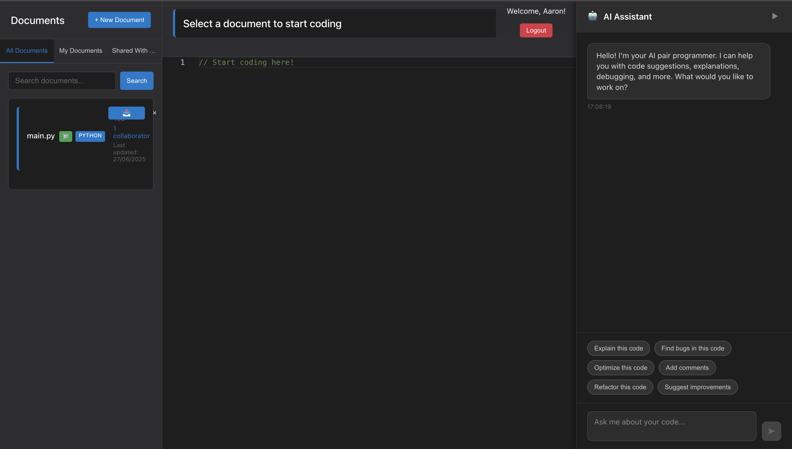

# 🚀 Collab Code AI - Real-Time Collaborative Code Editor with AI Pair Programmer

A modern, real-time collaborative code editor with AI assistance, built with React, Node.js, MongoDB, and Yjs for seamless multi-user coding experiences.


[](https://collab-code-ai-frontend.onrender.com)


## 📸 Screenshots

> Below are key screens from **Collab Code AI**. Click images to enlarge.

### 🏠 Main App Page  


### 🤝 Real-Time Collaboration  


### 🧠 AI Assistant in Action  


### 🆕 Create New Document  


### 🔗 Share Document Modal  


### 📝 Register Page  


### 🔐 Login Page  


## ✨ Features

### 🤝 Real-Time Collaboration
- **Live multi-user editing** with Yjs CRDT
- **Cursor presence** - See other users' cursors in real-time
- **User awareness** - Know who's online and editing
- **Conflict-free editing** - No data loss or conflicts
- **Document sharing** with read/write permissions

### 🤖 AI Pair Programmer
- **Context-aware code suggestions** using OpenAI GPT
- **Code explanation** and documentation
- **Bug detection** and fixes
- **Code optimization** recommendations
- **Quick prompts** for common tasks

### 🔐 User Management
- **JWT authentication** with refresh tokens
- **User registration** and login
- **Document ownership** and permissions
- **Collaborator management** - Add/remove users

### 💻 Modern Editor
- **Monaco Editor** (same as VS Code)
- **Syntax highlighting** for 15+ languages
- **Auto-save** functionality
- **Dark theme** with modern UI
- **Responsive design**

## 🏗️ Architecture

```
┌─────────────────┐    ┌─────────────────┐    ┌─────────────────┐
│   Frontend      │    │   Backend       │    │   WebSocket     │
│   (React)       │◄──►│   (Node.js)     │◄──►│   (Yjs)         │
│   Port: 3000    │    │   Port: 3001    │    │   Port: 1234    │
└─────────────────┘    └─────────────────┘    └─────────────────┘
         │                       │                       │
         └───────────────────────┼───────────────────────┘
                                 │
                    ┌─────────────────┐
                    │   MongoDB       │
                    │   Port: 27017   │
                    └─────────────────┘
```

## 🌐 Live Demo

**Try the live application**: [https://collab-code-ai-frontend.onrender.com](https://collab-code-ai-frontend.onrender.com)

- Register a new account or login with existing credentials
- Create documents and test real-time collaboration
- Open multiple browser tabs to see live editing in action

## 🚀 Quick Start

### Prerequisites
- Node.js 18+
- MongoDB (local or Atlas)
- OpenAI API key
- Docker (optional, for containerized deployment)

### Local Development

1. **Clone the repository**
   ```bash
   git clone https://github.com/yourusername/collab-code-ai.git
   cd collab-code-ai
   ```

2. **Set up environment variables**
   ```bash
   # Backend .env file
   cd backend
   cp .env.example .env
   ```
   
   Edit `backend/.env`:
   ```env
   MONGODB_URI=mongodb://localhost:27017/collab-code-ai
   JWT_SECRET=your-super-secret-jwt-key
   JWT_REFRESH_SECRET=your-super-secret-refresh-key
   OPENAI_API_KEY=your-openai-api-key
   ```

3. **Install dependencies**
   ```bash
   # Backend
   cd backend
   npm install
   
   # Frontend
   cd ../frontend
   npm install
   ```

4. **Start MongoDB**
   ```bash
   # Using Docker
   docker run -d -p 27017:27017 --name mongodb mongo:latest
   
   # Or install MongoDB locally
   ```

5. **Start the servers**
   ```bash
   # Terminal 1: Backend API
   cd backend
   npm start
   
   # Terminal 2: WebSocket Server
   cd backend
   node websocket-server.js
   
   # Terminal 3: Frontend
   cd frontend
   npm start
   ```

6. **Open your browser**
   - Frontend: http://localhost:3000
   - Backend API: http://localhost:3001
   - WebSocket: ws://localhost:1234

### Docker Deployment

1. **Build and run with Docker Compose**
   ```bash
   docker-compose up -d
   ```

2. **Access the application**
   - Frontend: http://localhost
   - Backend API: http://localhost:3001
   - WebSocket: ws://localhost:1234

## 📖 API Documentation

### Authentication Endpoints

#### Register User
```http
POST /api/auth/register
Content-Type: application/json

{
  "username": "john_doe",
  "email": "john@example.com",
  "password": "securepassword"
}
```

#### Login User
```http
POST /api/auth/login
Content-Type: application/json

{
  "email": "john@example.com",
  "password": "securepassword"
}
```

### Document Endpoints

#### Create Document
```http
POST /api/documents
Authorization: Bearer <token>
Content-Type: application/json

{
  "name": "My Project",
  "content": "console.log('Hello World!');",
  "language": "javascript"
}
```

#### Get User Documents
```http
GET /api/documents
Authorization: Bearer <token>
```

#### Get Owned Documents
```http
GET /api/documents/owned
Authorization: Bearer <token>
```

#### Get Shared Documents
```http
GET /api/documents/shared
Authorization: Bearer <token>
```

### AI Endpoints

#### Get AI Suggestion
```http
POST /api/ai/suggest
Authorization: Bearer <token>
Content-Type: application/json

{
  "code": "function add(a, b) {",
  "prompt": "Complete this function"
}
```

### Collaboration Endpoints

#### Share Document
```http
POST /api/collaboration/share/:documentId
Authorization: Bearer <token>
Content-Type: application/json

{
  "email": "collaborator@example.com",
  "permission": "write"
}
```

## 🔧 Configuration

### Environment Variables

| Variable | Description | Default |
|----------|-------------|---------|
| `MONGODB_URI` | MongoDB connection string | `mongodb://localhost:27017/collab-code-ai` |
| `JWT_SECRET` | JWT signing secret | `devsecret` |
| `JWT_REFRESH_SECRET` | JWT refresh secret | `devrefreshsecret` |
| `OPENAI_API_KEY` | OpenAI API key | Required |
| `PORT` | Backend port | `3001` |
| `WS_PORT` | WebSocket port | `1234` |

### Frontend Configuration

Edit `frontend/src/services/api.ts` to change API endpoints:
```typescript
const API_BASE_URL = process.env.REACT_APP_API_URL || 'http://localhost:3001/api';
```

## 🚀 Deployment

### Render (Recommended)

1. **Deploy Backend**
   - Connect your GitHub repo to Render
   - Create a new Web Service
   - Set build command: `cd backend && npm install`
   - Set start command: `cd backend && npm start`
   - Add environment variables

2. **Deploy Frontend**
   - Create a new Static Site
   - Set build command: `cd frontend && npm install && npm run build`
   - Set publish directory: `frontend/build`

3. **Deploy WebSocket Server**
   - Create another Web Service for the WebSocket server
   - Set start command: `cd backend && node websocket-server.js`

### Heroku

1. **Create Heroku apps**
   ```bash
   heroku create your-app-backend
   heroku create your-app-frontend
   heroku create your-app-websocket
   ```

2. **Deploy backend**
   ```bash
   cd backend
   heroku git:remote -a your-app-backend
   git push heroku main
   ```

3. **Deploy frontend**
   ```bash
   cd frontend
   heroku git:remote -a your-app-frontend
   git push heroku main
   ```

### AWS

1. **EC2 for Backend & WebSocket**
   - Launch EC2 instance
   - Install Node.js and MongoDB
   - Deploy using PM2

2. **S3 + CloudFront for Frontend**
   - Upload built React app to S3
   - Configure CloudFront for CDN

## 🧪 Testing

### Manual Testing
1. Open two browser windows
2. Register/login with different accounts
3. Create a document and share it
4. Test real-time collaboration
5. Test AI suggestions

### Automated Testing
```bash
# Backend tests
cd backend
npm test

# Frontend tests
cd frontend
npm test
```

## 🤝 Contributing

1. Fork the repository
2. Create a feature branch: `git checkout -b feature/amazing-feature`
3. Commit your changes: `git commit -m 'Add amazing feature'`
4. Push to the branch: `git push origin feature/amazing-feature`
5. Open a Pull Request

## 📝 License

This project is licensed under the MIT License - see the [LICENSE](LICENSE) file for details.

## 🙏 Acknowledgments

- [Yjs](https://github.com/yjs/yjs) for CRDT implementation
- [Monaco Editor](https://microsoft.github.io/monaco-editor/) for the code editor
- [OpenAI](https://openai.com/) for AI capabilities
- [Socket.IO](https://socket.io/) for real-time communication

## 📞 Support

- **Issues**: [GitHub Issues](https://github.com/yourusername/collab-code-ai/issues)
- **Discussions**: [GitHub Discussions](https://github.com/yourusername/collab-code-ai/discussions)
- **Email**: your-email@example.com

---

**Made with ❤️ by Aaron Malhi** 